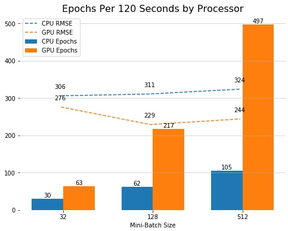
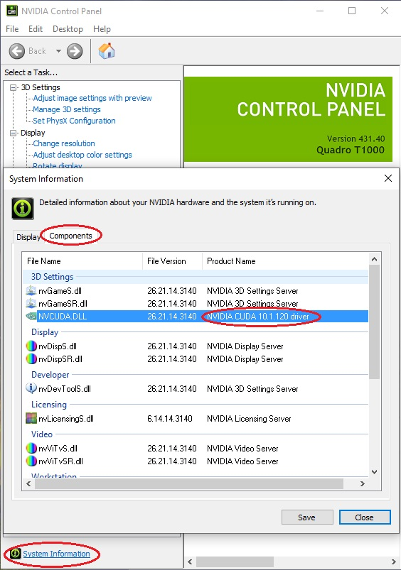

# Python Setup for Windows 10

### Step 1: Downloading Python
#### Download Anaconda
We will be downloading the Anaconda distribution of Python.
Anaconda comes with many data science packages we will be using and makes managing environments easy.
You can download Anaconda from this link:
https://www.anaconda.com/distribution/

I suggest using the default setting and installing it to this path: C:\Users\\<your_user_name>\anaconda

#### Update Anaconda
Next, you should update Anaconda and its packages.
In the recently added section of the start menue, you should see a shortcut for the Anaconda Powershell Prompt.
I suggest also saving this link to your start menu or taskbar because you will be coming here a lot.
Open Anaconda Powershell and run the following commands:

    conda update conda
    conda update anaconda
    conda update –all

Now everything should be updated and you are ready to set up your coding environments.

### Step 2: Setting up Conda Environments
Many python packages depend on other packages to run correctly.
Your base (default) environment has gone through significant testing to ensure that each package works well with each other.
Adding new packages could create problems so it is a good idea to set up custom environments when you are looking to add new packages.

There are two main approaches to setting up environments:

**Developers** like to set up custom environments for every project to ensure that future updates will not break legacy code.
This approach also allows you to download only what is needed, freeing up namespace.

**Data scientists** tend to set up a few environments that can run all their code.
This makes prototyping, ad-hoc analysis, and on the fly modeling very quick.
I will be using this approach although the techniques can apply to both.

#### Setup a TensorFlow Environment
TensorFlow makes building and tuning neural networks very simple.
To create an environment that includes TensorFlow as well as other common data science packages,
open Anaconda Powershell and run the following commands
(note, I am naming the environment tf-cpu but you can replace this with any name you wish):

    conda create -n tf-cpu
    conda activate tf-cpu
    conda install tensorflow pandas matplotlib jupyter notebook scipy scikit-learn xlrd

#### Setup a TensorFlow GPU Environment

While a CPU is very fast at what it does, an 8 core processor can only do 8 calculations at the same time.
A GPU core is slower but their can be thousands of them which might be much faster depending on your application.
For example, if you are using a time-series model that has to go 1 row at a time, the CPU is likely to be more efficient.
For most machine learning models where much of the data can be calculated at the same time,
using the GPU can provide significant performance boosts.

Here is an example showing GPU performance increases using a neural network on a typical ML dataset:

Notice that at every batchsize (i.e. data rows being looked at per calculation),
the GPU outperformed the CPU by finishing more epochs (training cycles) with higher accuracy (lower RMSE).
As batch sizes increase, the GPU's speed advantage becomes even even greater although the accuracy sweet-spot appears to be in the middle.

##### Getting Started
Before setting up a GPU environment, you need to ensure that you have a Nvidia CUDA-capable GPU.
Right click your desktop and open the Nvidia Control Panel.
Open System Information and click the Components tab.  Here you should see if there is a CUDA driver installed.

If you do not see this driver listed, you may need to update your graphics driver.
If your GPU is CUDA capable, you will be able to find it listed at this link: https://developer.nvidia.com/cuda-gpus

##### Creating the Environment
This process is very similar to the CPU environment.
First, activate your base environment (`conda activate base`) (or open a new Powershell) and run the following commands:

    conda create -n tf-gpu
    conda activate tf-gpu
    conda install tensorflow-gpu pandas matplotlib jupyter notebook scipy scikit-learn xlrd

To test that everything is running correctly, run these commands:

    python
    import tensorflow as tf
    tf.test.is_gpu_available()

It should return True if working correctly.  To exit python, type `quit()`
#### Installing non-Conda Packages
Occasionally, new or experimental packages may not be available via conda install and will need to be pip installed.
While many of these packages are stable, there is a greater chance of them creating issues with your environment.
It is a good idea to create experimental environments for new packages until you are comfortable adopting them into your core environments.

**ALWAYS REMEMBER:** You must navigate to your site-packages folder before doing a pip install.
Iif you do not, the package will be installed to your base environment even if you have another environment activated.
For this example, we will install the xgboost package (a new and very accurate ML model),
and pmdarima (an auto-arima model for time-series forecasting).

    conda activate <env_name>
    cd anaconda/envs/<env_name>/Lib/site-packages
    pip install xgboost pmdarima

Note, your path may be different depending on where you installed Anaconda to.

### Step 3: Running Python Within Environments
Now you are ready to run jupyter notebooks from your environment.
In the start menu under recently added, you should see a new jupyter notebook shortcut with your environment name.
You can also find the shortcuts at this path:

C:\Users\<your_user_name>\AppData\Roaming\Microsoft\Windows\Start Menu\Programs\Anaconda3 (64-bit)

Save this link and run it to automatically launch jupyter notebook in your environment.
You can run this code in jupyter to ensure that you installed the correct versions of TensorFlow:

    import tensorflow as tf
    tf.__version__
    tf.test.is_gpu_available()

The last cell should say True or False depending on if you are in the GPU or CPU environment.
Remember that you can run the same notebook using multiple environments so there is no need to duplicate your code.
You are now ready to go. I hope you appreciate this tutorial, many kilowatts died to bring you this information.